# Integrative Transcriptomic, Functional, and Network-Based Analysis of Pediatric Brain Tumors in GSE50161

### _Network-Based Data Analysis Project | GEO accession GSE50161_

---
## Frederick , FAC, Abi Chahine
> M.Sc. in Quantitative & Computational Biology, University of Trento, Italy

---

## Abstract

Pediatric brain tumors are biologically heterogeneous central nervous system malignancies in which tumor lineage, developmental state, immune infiltration, and normal brain contamination can all shape bulk gene-expression profiles.
This project analyzed GSE50161, a GEO Affymetrix GPL570 microarray dataset containing 130 samples from ependymoma, glioblastoma, medulloblastoma, pilocytic astrocytoma, and normal brain.
The main biological question was whether expression profiles could distinguish tumor types and reveal pathways linked to tumor growth, neural identity loss, immune context, and tumor microenvironment remodeling.
After preprocessing, the final gene-level matrix contained 20,007 annotated genes; tumor-vs-normal limma analysis identified 4,759 significant genes at FDR < 0.05 and absolute log2 fold change >= 1.
Tumors showed strong upregulation of proliferation and cell-cycle genes such as `TOP2A`, `RRM2`, `UHRF1`, and `CDK1`, while normal brain showed higher neuronal and synaptic markers such as `GJB6`, `SLC12A5`, `PACSIN1`, and `GABRA1`.
Random Forest, LASSO, Ridge, and LDA classified the five tissue classes with cross-validated accuracies of 0.938, 0.938, 0.931, and 0.877, and enrichment/network analyses highlighted synaptic structure, nervous system development, Rho-family GTPase signaling, DNA repair, extracellular matrix organization, and subtype-specific transcriptional signatures.

## Introduction

Pediatric brain tumors are among the most clinically important and biologically diverse childhood cancers. In the United States, SEER reports that childhood brain and other nervous system cancers account for approximately 14.3% of new childhood cancer cases, have an age-adjusted incidence of about 2.7 new cases per 100,000 children per year, and remain the leading cause of childhood cancer death [17]. Broader registry estimates that include both malignant and non-malignant primary brain/CNS tumors report an annual average incidence of 6.05 per 100,000 children and adolescents between 2017 and 2021, with an estimated 4,860 new pediatric/adolescent cases expected in the United States in 2025 [18].

These tumors are not a single disease. Ependymoma (EPN), glioblastoma (GBM), medulloblastoma (MED), and pilocytic astrocytoma (PA) differ in developmental origin, grade, anatomical distribution, treatment response, and tumor microenvironment. MED is an embryonal tumor class with strong developmental patterning; EPN arises in relation to ventricular and ependymal-lineage biology; PA is usually a low-grade glioma with frequent MAPK pathway activation; and pediatric GBM is an aggressive high-grade glioma with molecular features distinct from adult GBM. Their transcriptional profiles can therefore be used both to understand tumor biology and to identify candidate biomarkers for subtype classification or therapeutic prioritization.

The GSE50161 dataset was generated to study immune features of pediatric brain tumors. According to GEO, gene expression profiles were obtained from surgical tumor and normal brain samples using Affymetrix HG-U133 Plus 2.0 arrays, and comparative analyses were used to identify immune marker genes differentially expressed across tumor types and normal brain [1]. The associated publication by Griesinger et al. reported distinct immunophenotypes across pediatric brain tumor types, including large differences in myeloid infiltration between PA, EPN, GBM, MED, and normal tissue [2].

The goal of this project was to extend that biological question into a complete computational pipeline. Rather than restricting the analysis to predefined immune markers, the full expression matrix was used to examine global transcriptomic separation, identify tumor-vs-normal and tumor-type-specific genes, test whether machine-learning models can recover known sample labels, infer rank-based transcriptional signatures, and connect gene lists to functional pathways and networks.

## Methods

### Dataset and Sample Structure

GSE50161 was downloaded from GEO using `GEOquery` [3]. The dataset contains 130 human samples profiled on the Affymetrix Human Genome U133 Plus 2.0 Array platform GPL570. Sample groups were parsed from GEO sample titles (Table 1).

**Table 1. Sample composition of GSE50161 after parsing GEO sample titles.**

| Group | Biological label | Samples |
|---|---:|---:|
| Normal | Normal brain tissue | 13 |
| EPN | Ependymoma | 46 |
| GBM | Glioblastoma | 34 |
| MED | Medulloblastoma | 22 |
| PA | Pilocytic astrocytoma | 15 |

The processed GEO expression matrix contained 21,050 probes and 130 samples. Probe annotation was taken from the GPL570 platform annotation supplied by GEO. Probes without gene symbols were removed for gene-level analyses. When multiple probes mapped to the same gene symbol, the probe with the largest variance across samples was retained. This produced a final gene-level matrix of 20,007 genes by 130 samples.

### Preprocessing and Quality Control

The expression values ranged from 0.485 to 16.654, with median 6.557, indicating that the GEO series matrix was already on a log2-like scale. Therefore, no additional log2 transformation was applied. Between-array quantile normalization was applied because the automatic distribution check detected sample distribution differences. Quality control used boxplots and density plots of the processed expression matrix. These plots were used to evaluate whether samples had comparable medians, interquartile ranges, and global expression-density shapes after preprocessing.

### Differential Expression Analysis

Differential expression was performed with `limma` [4], a standard empirical-Bayes framework for microarray and RNA-seq expression analysis. `limma` fits a linear model for each gene and then borrows information across genes to stabilize variance estimates, which is especially useful when sample sizes are moderate and thousands of genes are tested simultaneously. Two designs were used:

1. Tumor vs normal, where EPN, GBM, MED, and PA were combined as tumor.
2. Tumor-type-specific contrasts against normal brain: EPN vs Normal, GBM vs Normal, MED vs Normal, and PA vs Normal.

Genes were considered significant when adjusted P value < 0.05 and absolute log2 fold change >= 1. Volcano plots and a heatmap of the top 50 tumor-vs-normal genes were generated.

### PCA and Unsupervised Clustering

Principal component analysis was performed on the 2,000 most variable genes. PCA is an unsupervised dimensionality-reduction method that rotates high-dimensional expression data into orthogonal axes ordered by explained variance. In this project, PCA was used to test whether major tumor classes or normal brain samples separated along dominant expression gradients before any supervised labels were used.

K-means clustering was applied to the first 10 PC scores using k = 2 and k = 5. K-means partitions samples into a predefined number of clusters by minimizing within-cluster squared distances, making it useful for asking whether the data naturally form two broad states or approximately five diagnostic groups. Hierarchical clustering used a Pearson-correlation sample distance and Ward linkage. Unlike k-means, hierarchical clustering does not require a fixed number of clusters in advance and instead builds a dendrogram of sample similarity. These unsupervised methods were used to evaluate whether known tumor classes appeared as dominant transcriptomic axes without using labels.

### Supervised Classification

The 1,000 most variable genes were used as predictors for supervised classification. Supervised learning differs from PCA and k-means because it explicitly uses known sample labels during training and then tests whether expression features can predict those labels. Stratified five-fold cross-validation was used so that every fold preserved the relative representation of Normal, EPN, GBM, MED, and PA samples. This helps estimate model generalizability while reducing class-imbalance artifacts. Four model families were evaluated:

- Random Forest with 1,000 trees [5]. Random Forest is an ensemble of decision trees trained on bootstrap samples and random subsets of predictors. It is robust to nonlinear relationships and provides feature-importance scores.
- Linear Discriminant Analysis using selected high-F-score genes [6]. LDA projects samples into axes that maximize separation among predefined classes while assuming approximately shared class covariance.
- Multinomial LASSO regression using `glmnet` with alpha = 1 [7]. LASSO imposes an L1 penalty, shrinking many coefficients to zero and producing a sparse classifier.
- Multinomial Ridge regression using `glmnet` with alpha = 0 [7]. Ridge imposes an L2 penalty, shrinking correlated features together rather than selecting only a few genes.

Additional repeated cross-validation was run with `caret` [8] for Random Forest, LDA, and glmnet. Feature importance, discriminant coordinates, coefficient tables, confusion matrices, and model comparison plots were saved.

### Rank-Based Transcriptional Signatures

Rank-based transcriptional signatures were generated in two ways. Rank-based methods focus on the relative ordering of genes within each sample rather than absolute expression intensity. This makes them useful for cross-platform comparisons because gene ranks can be more stable than raw expression values when data are generated by different technologies or batches. First, a direct fallback approach identified the top 100 overexpressed and underexpressed genes per sample after centering each gene by its mean expression. Consensus genes were summarized by class. Second, formal `rScudo` rank-based classification was run with `caret` partitioning [9,10].

### Functional Enrichment

The primary enrichment input was the tumor-vs-normal significant gene set. Functional enrichment asks whether a gene list contains more genes from a pathway, ontology term, or regulatory category than expected by chance. This converts long DEG tables into interpretable biological themes, such as synaptic signaling, cell-cycle control, immune migration, or extracellular matrix organization. Functional enrichment was performed using:

- `gprofiler2` for multi-database gene-list enrichment [11].
- `clusterProfiler` for GO and KEGG enrichment [12].
- `ReactomePA` for Reactome pathway enrichment [13].
- A GPL570 annotation-based GO fallback using Fisher exact tests.

### Network-Based Analysis

Network-based analysis was used because genes do not act independently. Pathways, protein-protein interactions, and co-expression modules can reveal coordinated biological structure that is not obvious from single-gene ranking alone. Network-based analysis used three complementary strategies:

1. `pathfindR` active-subnetwork enrichment using Reactome gene sets and the BioGRID protein interaction network [14]. This method searches for connected subnetworks enriched for significant genes and then tests whether these subnetworks map to known pathways.
2. `STRINGdb` mapping and PPI retrieval for significant tumor-vs-normal genes [15]. STRING provides known and predicted protein associations, helping place DEGs into broader interaction context.
3. A co-expression network built from primary DEG genes, where edges were selected using absolute Pearson correlation and FDR filtering. Network centrality was computed with `igraph` [16], including degree, strength, closeness, betweenness, eigenvector centrality, and Louvain community assignment. High-degree nodes represent local hubs, high-betweenness nodes may bridge modules, and high-eigenvector-centrality nodes are connected to other well-connected genes.

Network files were exported for Cytoscape as CSV and GraphML.

## Results

### Dataset Structure and Preprocessing

The dataset was successfully loaded and all 130 samples were assigned to one of five classes, as summarized in Table 1. The final gene-level expression matrix contained 20,007 genes. The processed expression values showed a log2-like distribution, so no log2 transform was applied. Quantile normalization was applied to improve sample comparability.

The boxplot and density plots showed broadly comparable distributions after preprocessing, supporting downstream differential expression and classification. The normal brain group had only 13 samples, which should be considered when interpreting tumor-vs-normal contrasts.

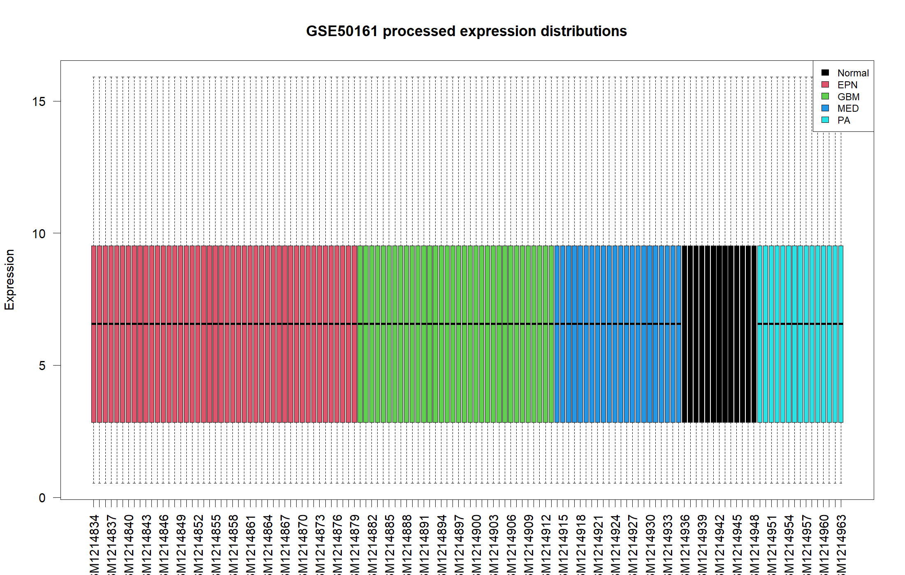

*Figure 1. Boxplot of processed GSE50161 expression values across all samples. Colors indicate the parsed biological group. Similar post-normalization distributions support downstream cross-sample comparisons.*

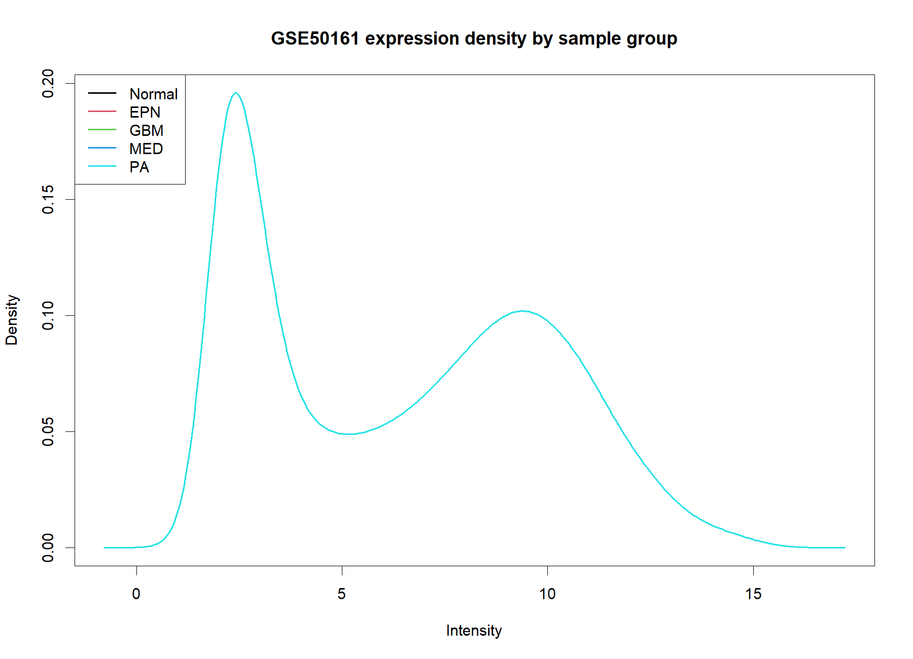

*Figure 2. Density plot of processed expression values grouped by tumor type or normal brain. The broadly comparable density profiles indicate that the expression scale is suitable for multivariate and differential-expression analyses.*

### Differential Expression

Large transcriptomic differences were observed between tumors and normal brain (Table 2).

**Table 2. Number of significant differentially expressed genes from limma contrasts using FDR < 0.05 and absolute log2 fold change >= 1.**

| Contrast | Upregulated | Downregulated | Total significant |
|---|---:|---:|---:|
| Tumor vs Normal | 2,417 | 2,342 | 4,759 |
| EPN vs Normal | 3,014 | 2,641 | 5,655 |
| GBM vs Normal | 2,643 | 2,463 | 5,106 |
| MED vs Normal | 2,866 | 2,789 | 5,655 |
| PA vs Normal | 2,392 | 2,152 | 4,544 |

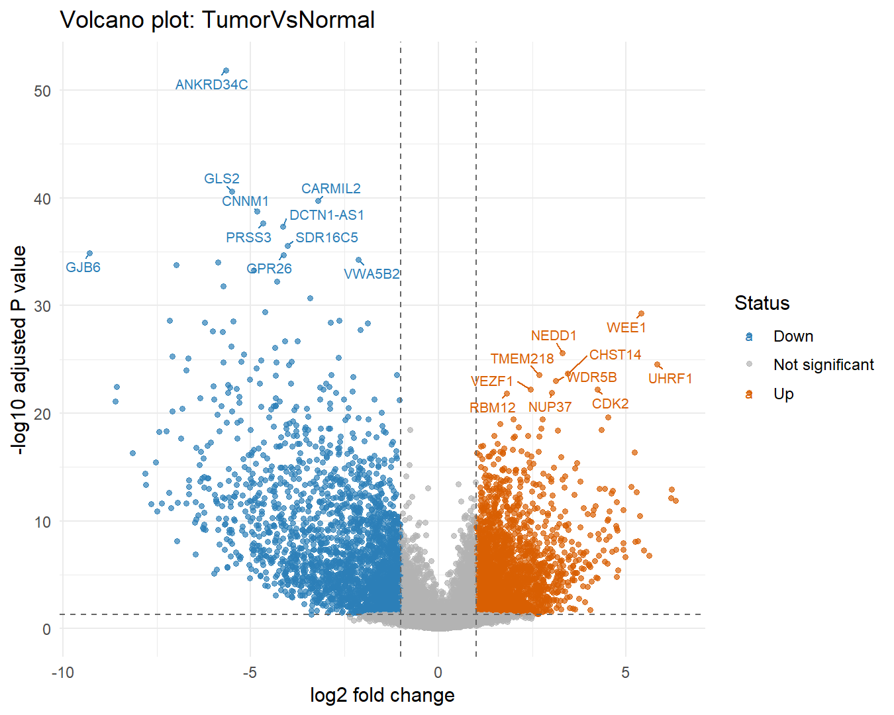

*Figure 3. Tumor-vs-normal volcano plot. Orange points are significantly upregulated genes in tumors, blue points are significantly downregulated genes in tumors, and gray points do not pass the chosen FDR/logFC thresholds. The plot labels the top 10 significant genes from each direction.*

The volcano plot was configured to label the top 10 significantly upregulated and top 10 significantly downregulated genes. The strongest tumor-upregulated genes included cell-cycle and proliferation-associated markers such as `TOP2A`, `KIAA0101`, `RRM2`, `UHRF1`, `WEE1`, `ASPM`, `NUSAP1`, and `CDK1`. The strongest tumor-downregulated genes included neuronal and synaptic markers such as `GJB6`, `SLC12A5`, `PACSIN1`, `SYNPR`, `VSNL1`, `NEFM`, `GABRG2`, `SST`, and `GABRA1`.

This directionality is biologically plausible: compared with normal brain, tumor samples showed increased proliferation and altered developmental or extracellular programs, while mature neuronal and synaptic transcripts were strongly reduced.

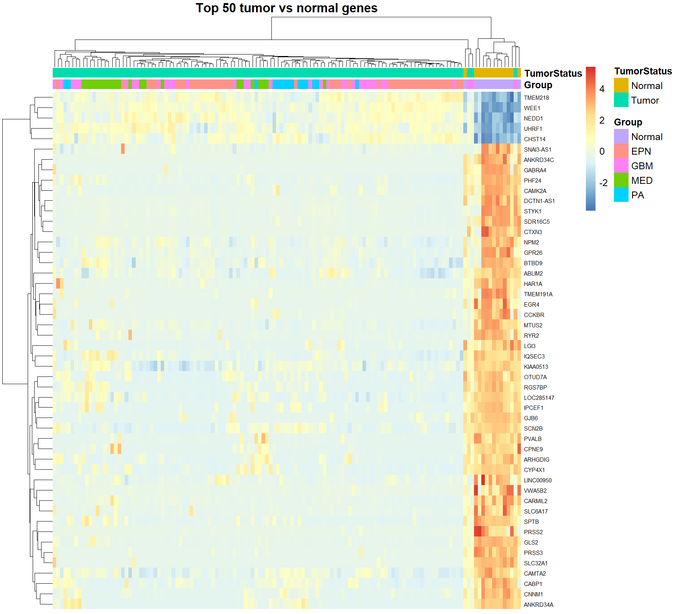

*Figure 4. Heatmap of the top 50 tumor-vs-normal genes ranked by adjusted P value. Expression values are row-scaled, showing that the strongest differential genes separate tumor and normal samples clearly.*

### PCA and Global Sample Structure

PCA showed strong global structure across the dataset (Figure 5). PC1 explained 23.23% of variance, PC2 explained 13.42%, and PC3 explained 11.73%. Thus, the first three PCs captured 48.37% of expression variance among the 2,000 most variable genes (Figure 6).

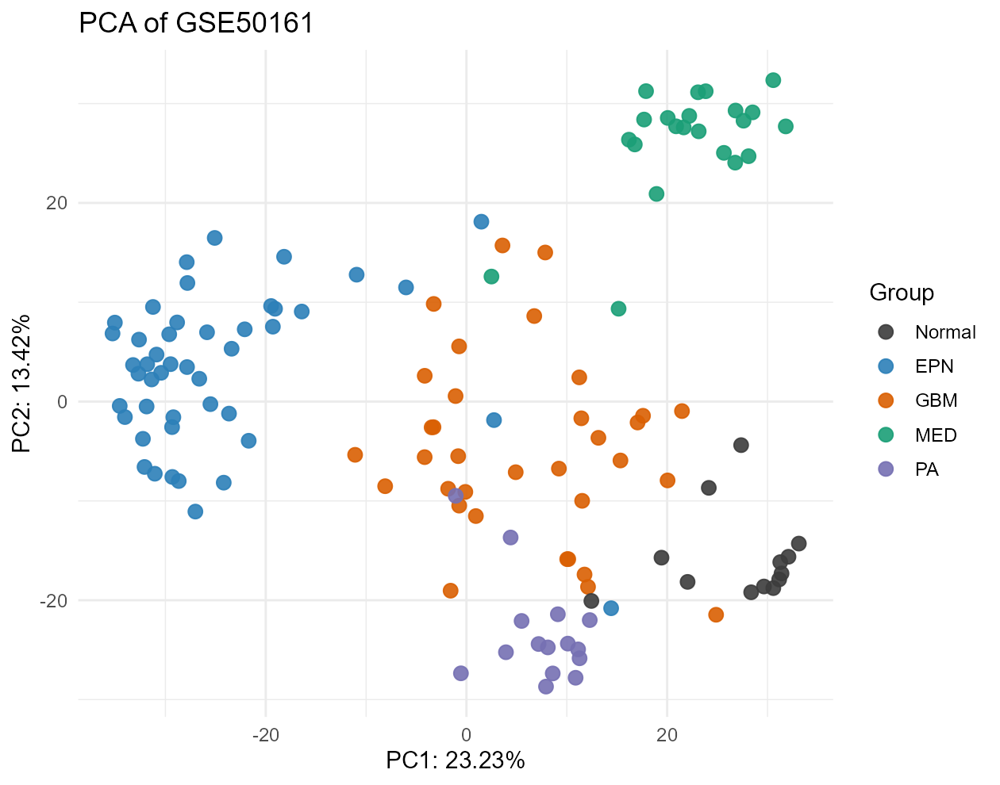

*Figure 5. Principal component analysis of the 2,000 most variable genes. Samples are colored by diagnostic group, revealing strong tumor-type-associated transcriptomic structure.*

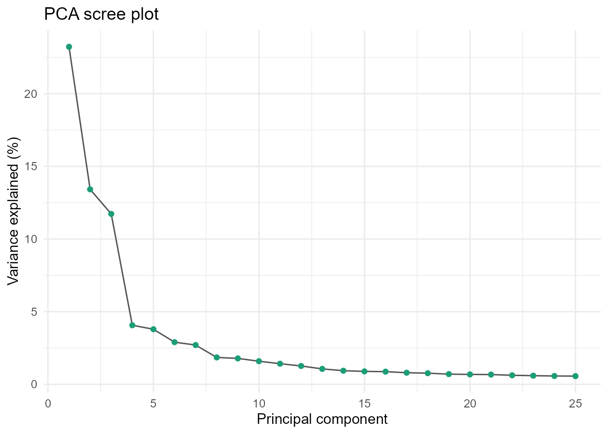

*Figure 6. Scree plot showing the percentage of variance explained by the first principal components. The first three components capture nearly half of the variance in the high-variance gene set.*

The PCA plot indicated that tumor classes are not randomly mixed. EPN formed a particularly distinct structure, MED was also well separated, and PA and GBM showed more overlap. Normal samples were separated from most tumors but were not the only driver of global variance.

### Unsupervised Clustering

K-means clustering with k = 2 primarily separated EPN from the rest of the dataset (Table 3 and Figure 7):

**Table 3. K-means clustering with k = 2 compared with known sample groups.**

| k = 2 cluster | Normal | EPN | GBM | MED | PA |
|---|---:|---:|---:|---:|---:|
| Cluster 1 | 0 | 43 | 0 | 0 | 0 |
| Cluster 2 | 13 | 3 | 34 | 22 | 15 |

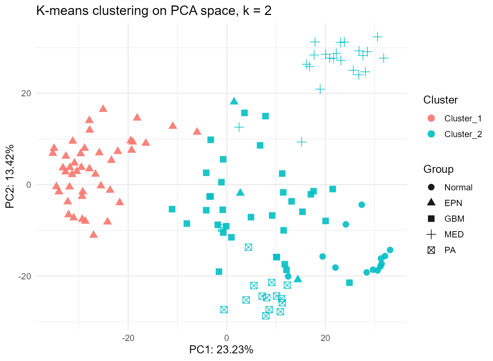

*Figure 7. K-means clustering with k = 2 displayed on the PCA projection. Cluster membership mainly isolates EPN samples, indicating that EPN is one of the strongest unsupervised signals in the dataset.*

With k = 5, the unsupervised structure became more class-specific (Table 4 and Figure 8). MED was almost perfectly isolated, EPN split into two clusters, normal samples were mostly clustered together, and GBM and PA remained close:

**Table 4. K-means clustering with k = 5 compared with known sample groups.**

| k = 5 cluster | Normal | EPN | GBM | MED | PA |
|---|---:|---:|---:|---:|---:|
| Cluster 1 | 0 | 9 | 0 | 0 | 0 |
| Cluster 2 | 0 | 35 | 0 | 0 | 0 |
| Cluster 3 | 13 | 0 | 1 | 0 | 0 |
| Cluster 4 | 0 | 2 | 33 | 1 | 15 |
| Cluster 5 | 0 | 0 | 0 | 21 | 0 |

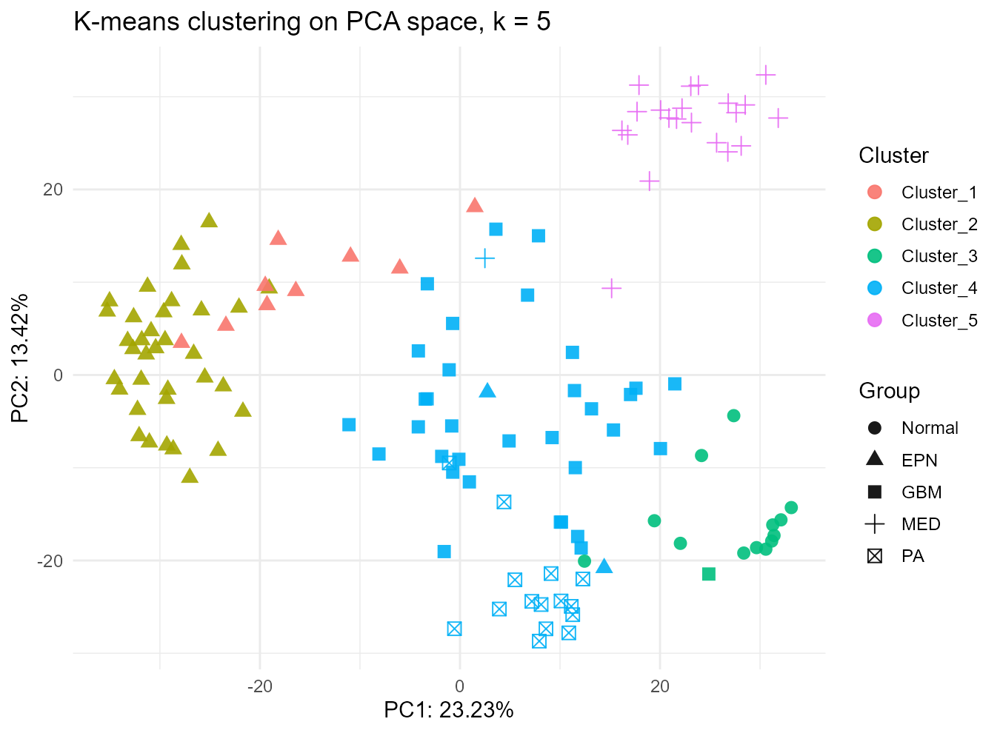

*Figure 8. K-means clustering with k = 5 displayed on the PCA projection. MED is nearly perfectly separated, while PA remains close to GBM in the unsupervised expression space.*

Hierarchical clustering and the sample correlation heatmap supported the same interpretation: several tumor classes have strong global expression identity, but PA and GBM share more similar bulk transcriptomic profiles than the other classes.

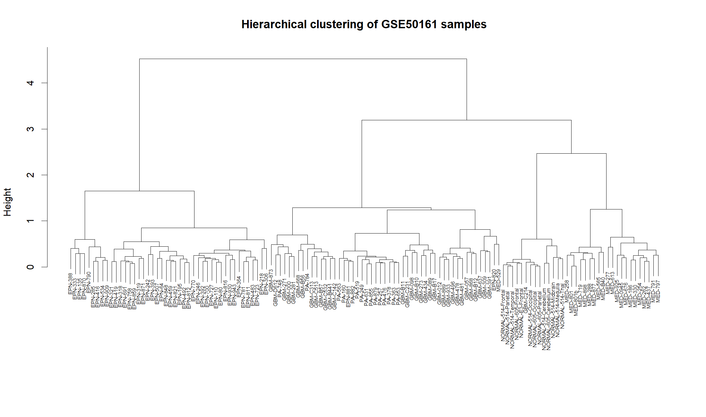

*Figure 9. Hierarchical clustering dendrogram based on sample-sample expression correlation. The tree provides a label-free view of the same class structure observed in PCA and k-means clustering.*

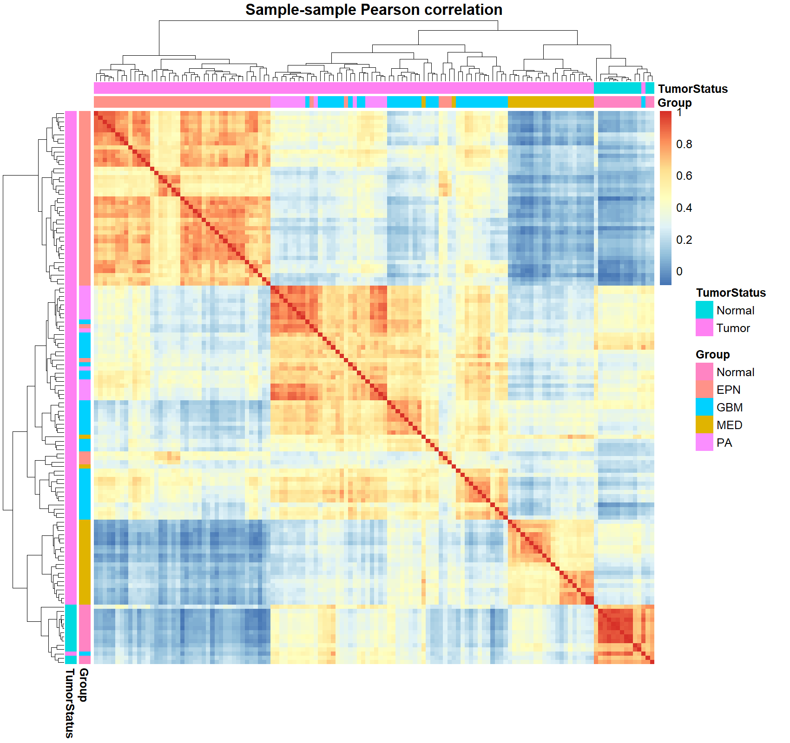

*Figure 10. Sample-sample Pearson correlation heatmap. Blocks of high correlation indicate transcriptionally similar sample groups and support the presence of tumor-type-associated expression modules.*

### Supervised Classification

Supervised models classified the five tissue groups accurately, showing that the group labels are strongly encoded in gene expression (Table 5).

**Table 5. Cross-validated classification performance for the four main supervised models.**

| Model | Accuracy | Balanced accuracy |
|---|---:|---:|
| Random Forest | 0.938 | 0.939 |
| LDA | 0.877 | 0.863 |
| LASSO | 0.938 | 0.917 |
| Ridge | 0.931 | 0.910 |

Repeated `caret` cross-validation gave similar or stronger results: Random Forest accuracy = 0.949, LDA accuracy = 0.872, and glmnet accuracy = 0.969.

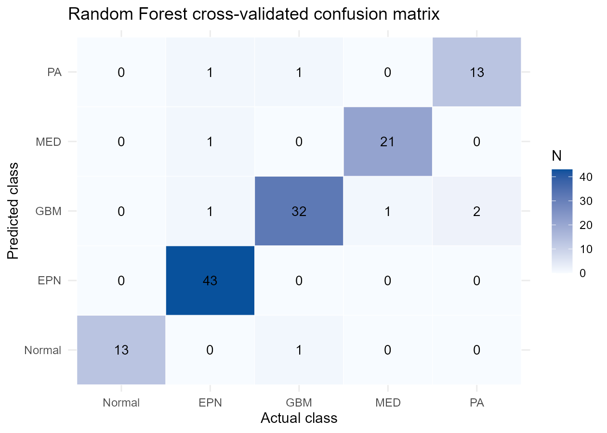

*Figure 11. Cross-validated Random Forest confusion matrix. Most classes are recovered with few errors, with the main ambiguity occurring between glioma-related groups.*

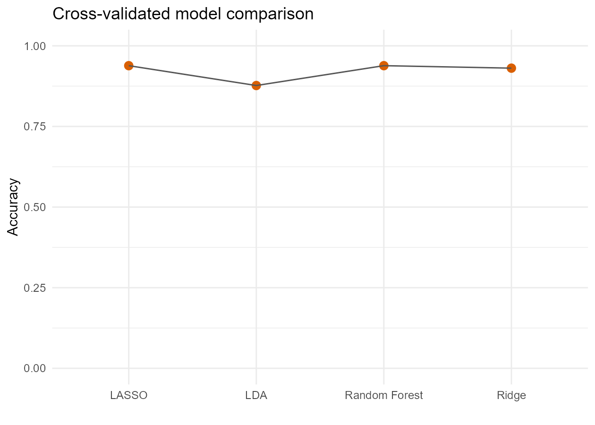

*Figure 12. Cross-validated accuracy comparison for Random Forest, LDA, LASSO, and Ridge models. Random Forest and LASSO show the strongest performance in the main five-fold evaluation.*

The Random Forest model performed especially well. It perfectly classified all normal samples, made only a small number of GBM/PA errors, and showed high balanced accuracy. Important Random Forest genes included `EFCAB1`, `DAW1`, `NACC2`, `ONECUT2`, `SPAG17`, `EFHC2`, `CFAP126`, `CAPSL`, `DNAAF3`, `AK7`, and `SOX2-OT`.

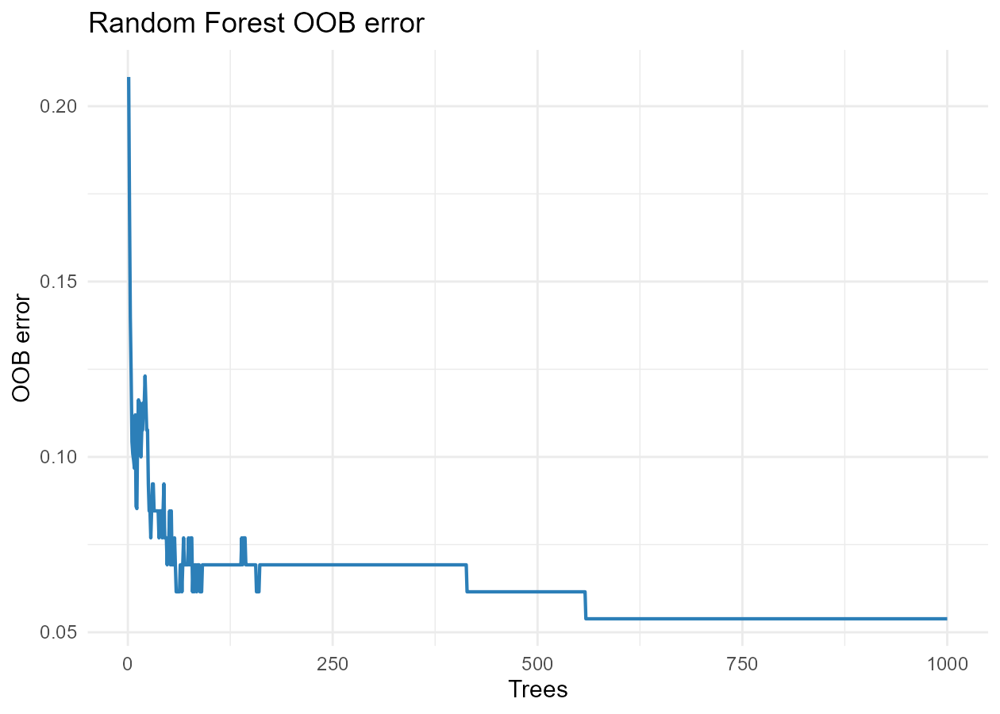

*Figure 13. Random Forest out-of-bag error across trees. Stabilization of the curve indicates that the chosen number of trees is sufficient for stable ensemble behavior.*

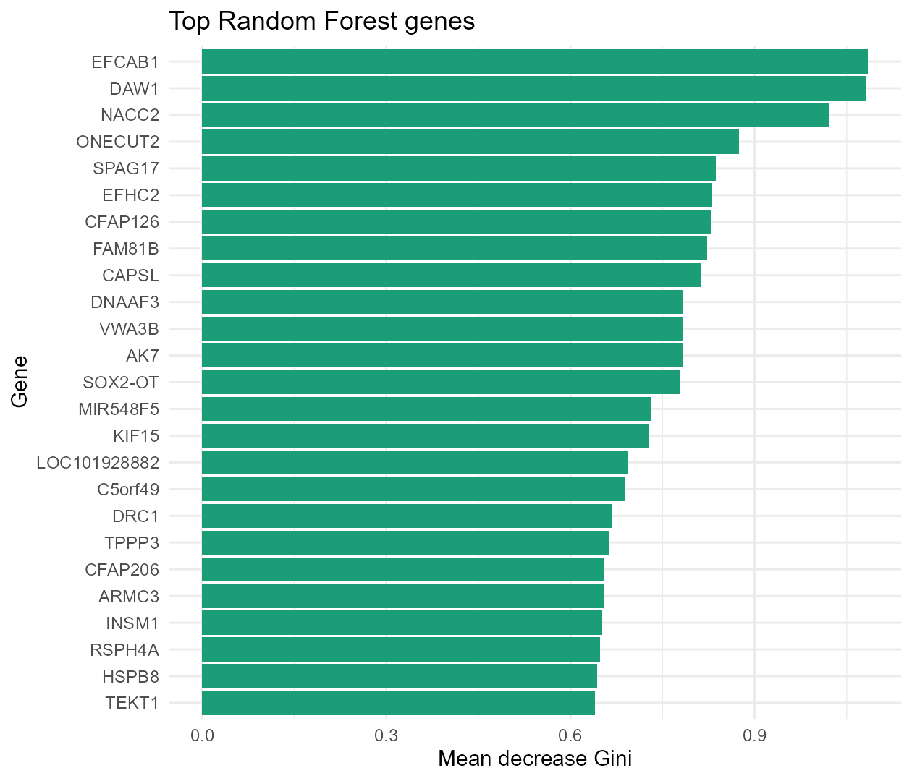

*Figure 14. Top 25 Random Forest feature-importance genes ranked by mean decrease in Gini impurity. These genes contribute strongly to distinguishing the five tissue classes.*

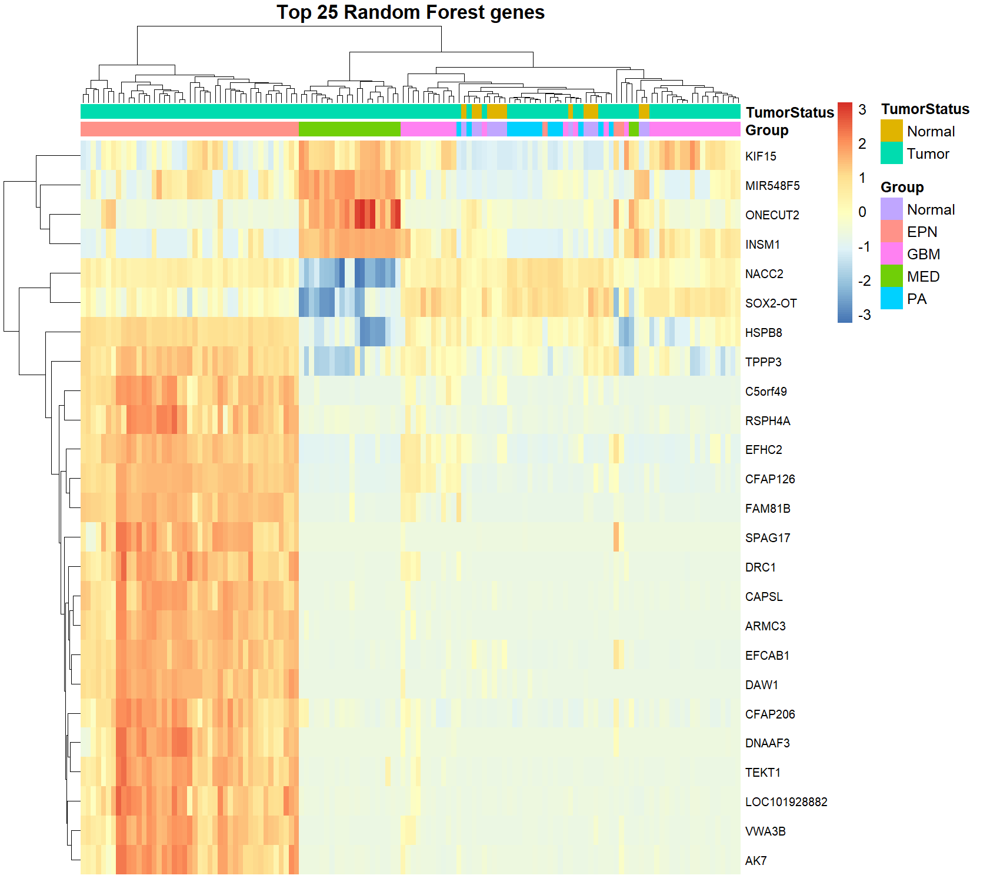

*Figure 15. Heatmap of the top Random Forest genes. Row-scaled expression shows class-associated expression patterns among the most discriminative features.*

LDA achieved lower but still strong performance. It showed most misclassification between GBM and PA, consistent with the unsupervised clustering results.

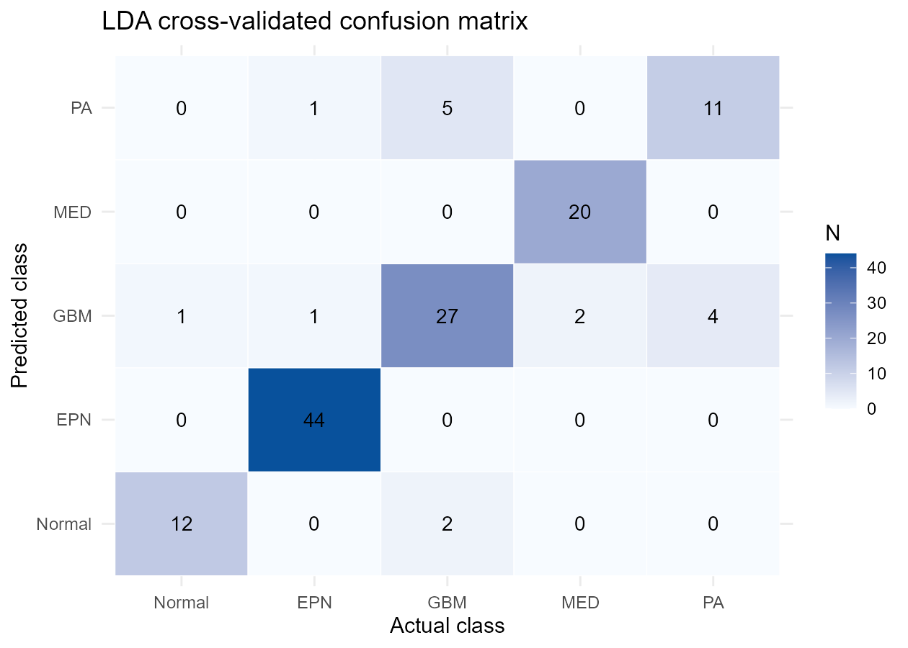

*Figure 16. Cross-validated LDA confusion matrix. LDA performs well overall but shows more GBM/PA ambiguity than Random Forest and regularized regression.*

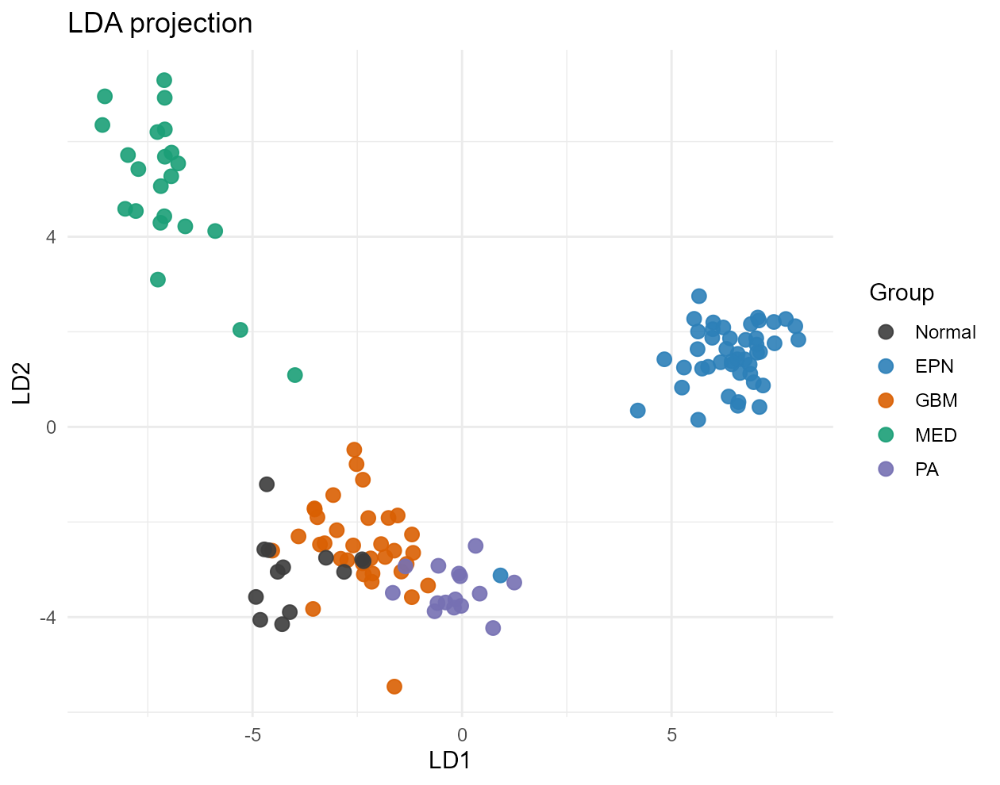

*Figure 17. LDA projection of samples onto discriminant axes. The plot shows label-informed separation of tumor classes using selected high-discrimination genes.*

LASSO and Ridge regression also performed well. LASSO produced a sparse gene set with high-impact coefficients, including class-associated markers such as `EFCAB1` for EPN, `TTYH1`, `EBF3`, `ONECUT2`, and `BARHL1` for MED, `SOX2-OT`, `TNFAIP6`, `FOXG1`, and `MELK` for GBM, and `COL8A1`, `COL20A1`, and `PLA2G2A` for PA.

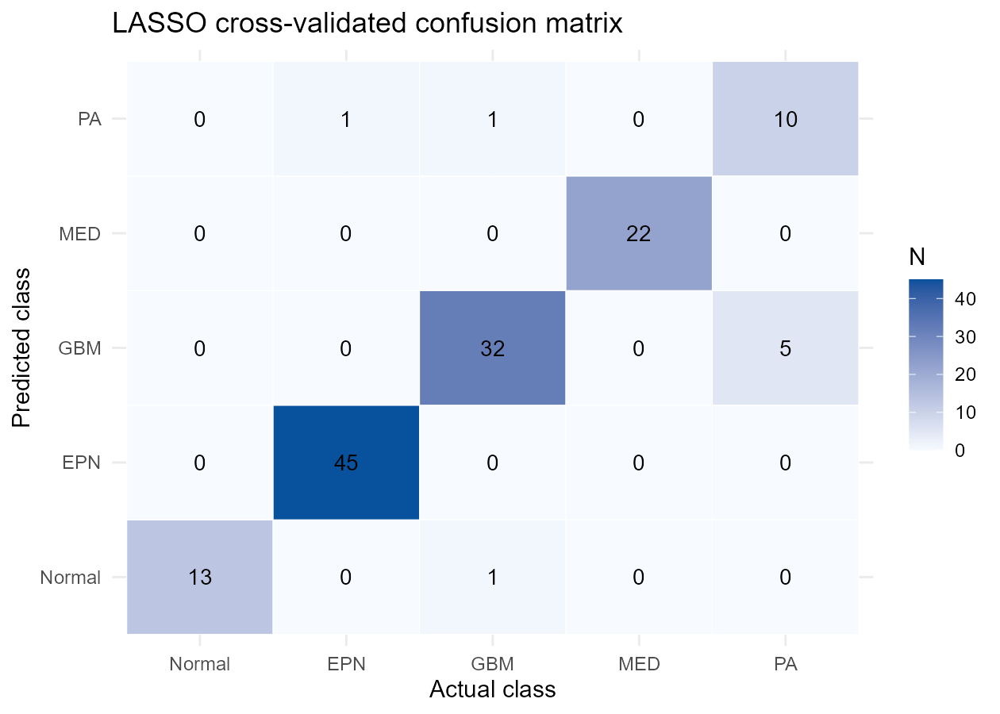

*Figure 18. Cross-validated LASSO confusion matrix. Sparse regularized regression achieves high accuracy while selecting a smaller set of informative genes.*

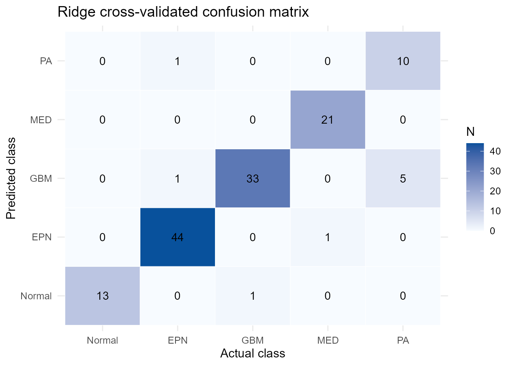

*Figure 19. Cross-validated Ridge confusion matrix. Ridge retains correlated gene groups and performs similarly to LASSO, though with slightly lower balanced accuracy.*

### Rank-Based Transcriptional Signatures

Rank-based signatures identified stable class-specific expression patterns. Normal brain signatures were dominated by neuronal and synaptic genes such as `PACSIN1`, `SLC12A5`, `SYNPR`, `VSNL1`, `GABRG2`, `GJB6`, `ETNPPL`, `GABRA1`, `RAB3C`, and `SV2B`. GBM rank signatures included `FOXG1`, `IL13RA2`, `XIST`, `KLRC2`, `CHRNA9`, `CXCL14`, `HOXC6`, and `NKX2-2`. PA signatures contained genes such as `COL20A1`, `SCN7A`, `SEMA3E`, `ALDH1A3`, `SOX10`, `POSTN`, and `PLA2G2A`.

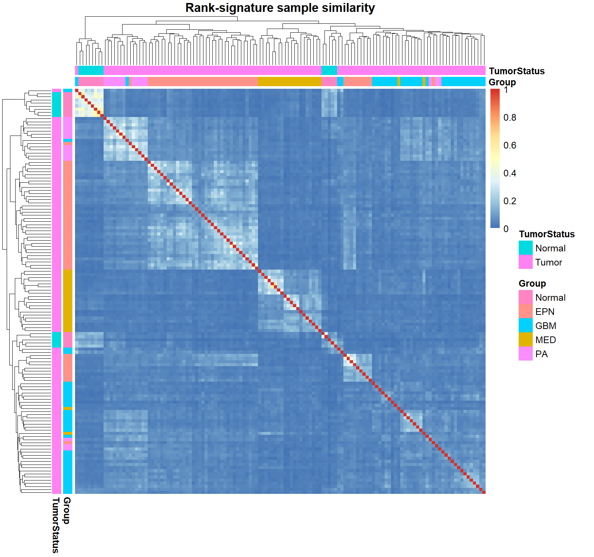

*Figure 20. Rank-signature sample similarity heatmap based on overlap of per-sample high- and low-ranking genes. Class-associated blocks indicate that rank-order expression signatures preserve biological group information.*

The formal rScudo classifier reached 0.861 accuracy on a held-out partition, with strongest sensitivity for Normal and MED and lower sensitivity for PA. This agrees with the other models: rank-based signatures capture robust biology, but PA remains the most difficult class because it overlaps with GBM and other tumor transcriptional programs.

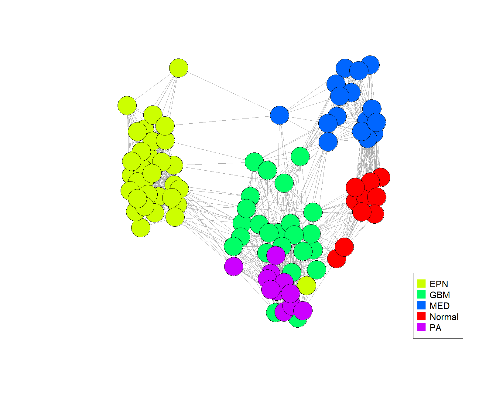

*Figure 21. rScudo rank-signature training network. Connections reflect sample similarity based on rank-based transcriptional signatures rather than absolute expression values.*

### Functional Enrichment

The g:Profiler enrichment analysis returned 4,593 significant terms. The strongest terms included `cell junction`, `synapse`, `cell projection`, `nervous system development`, `neuron projection`, `cell communication`, and E2F transcription factor motif enrichment. The g:Profiler summary plot was generated by selecting top terms within each annotation source rather than only the globally smallest P values. This is important because very broad GO terms can dominate a global top-term plot and visually hide KEGG or Reactome terms even when those sources are present and biologically relevant.

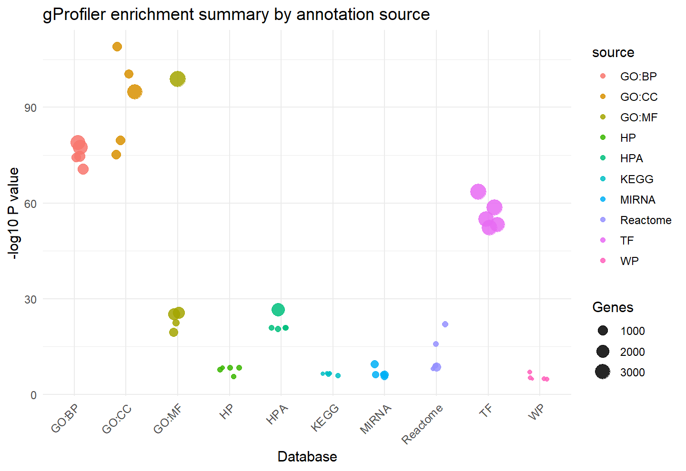

*Figure 22. g:Profiler enrichment summary by annotation source. The source-balanced plotting strategy makes KEGG and Reactome visible alongside GO, transcription factor, miRNA, WikiPathways, Human Phenotype Ontology, and Human Protein Atlas terms.*

ClusterProfiler GO enrichment highlighted biological processes such as regulation of Rho protein signal transduction, cell-cycle G2/M transition, amino acid biosynthesis, negative regulation of cell growth, centrosome cycle, sensory system development, and receptor-mediated endocytosis.

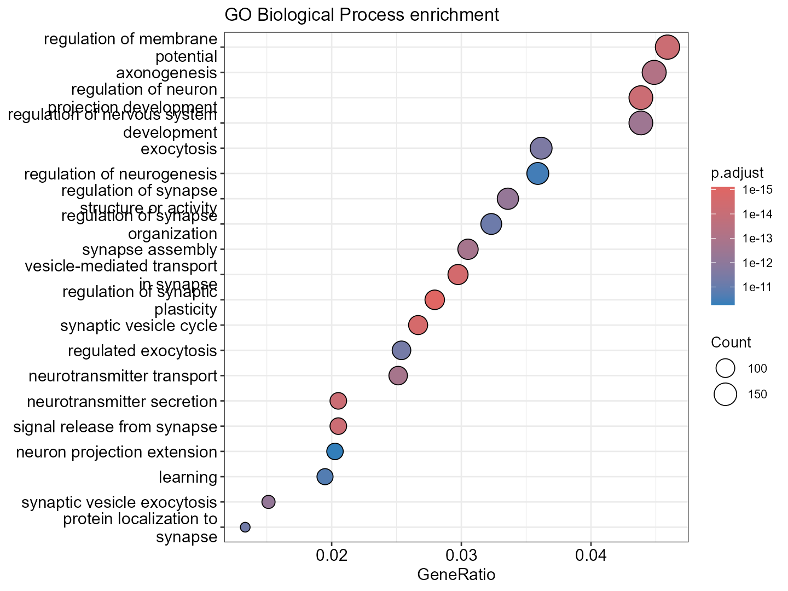

*Figure 23. GO Biological Process enrichment from clusterProfiler. Dot position, color, and size summarize enriched processes among tumor-vs-normal significant genes.*

KEGG enrichment included cGMP-PKG signaling, Ras signaling, TGF-beta signaling, leukocyte transendothelial migration, and other immune, signaling, and extracellular matrix-related categories. ReactomePA enrichment included fibronectin matrix formation, RHOB and RAC2 GTPase cycles, ECM proteoglycans, telomere synthesis, and platelet/megakaryocyte-related terms.

The fallback GPL570 GO analysis independently supported a strong nervous-system, synaptic, cell-junction, and developmental signal.

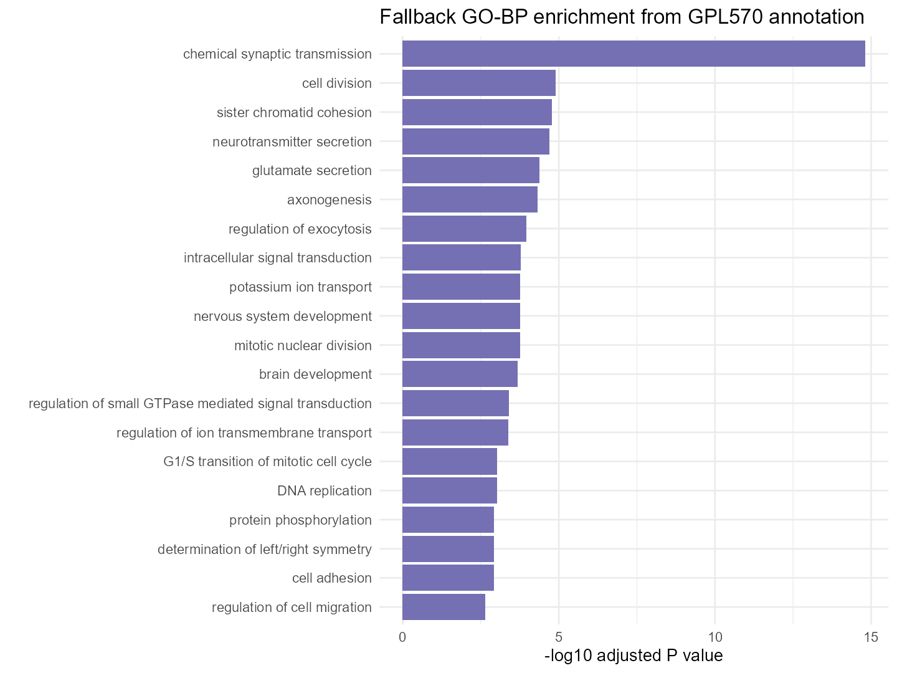

*Figure 24. Platform-annotation fallback GO Biological Process overrepresentation analysis. This independent fallback confirms that core biological themes are not dependent on a single enrichment package.*

### Network-Based Enrichment and Centrality

pathfindR identified 881 enriched Reactome terms using active-subnetwork analysis. Top network-based terms included CDC42 GTPase cycle, RAC1 GTPase cycle, SUMOylation, RHOJ GTPase cycle, cell-cycle checkpoints, DNA double-strand break repair, homology-directed repair, G2/M checkpoint, extracellular matrix organization, and regulation of TP53 activity.

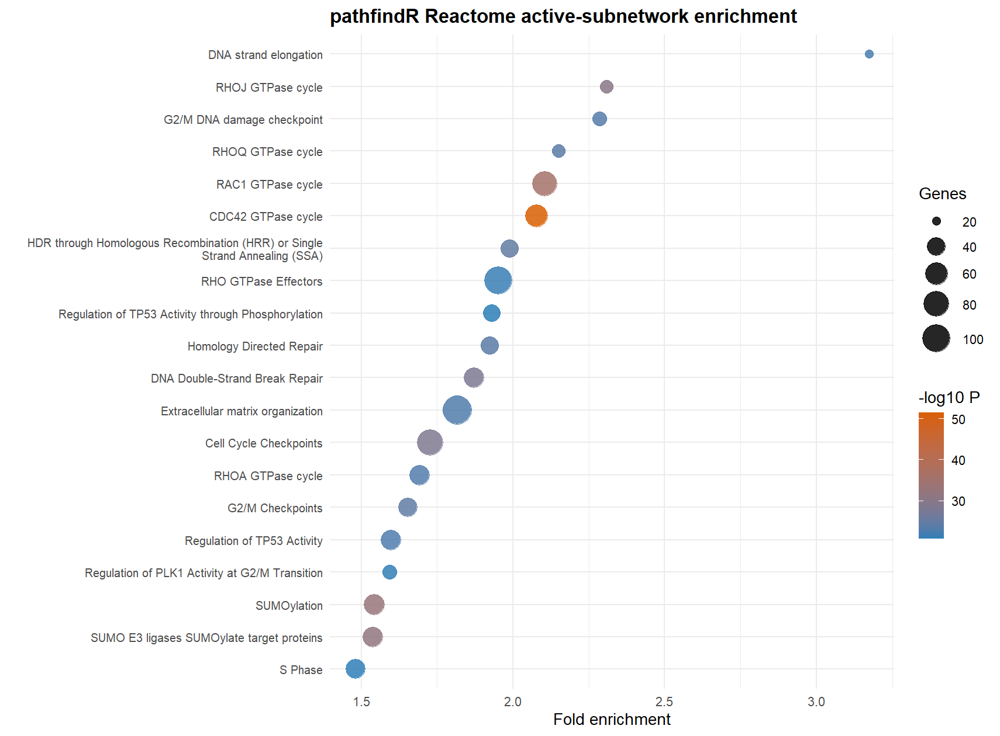

*Figure 25. pathfindR Reactome active-subnetwork enrichment. Dot color represents pathway significance as -log10 P value, dot size represents the number of involved genes, and the x-axis shows fold enrichment.*

STRINGdb mapped 4,439 significant genes and retrieved 132,652 interactions, indicating that most tumor-vs-normal genes could be placed into known protein association networks.

The custom co-expression network contained 297 edges and was exported as GraphML and CSV for Cytoscape. The highest-degree hubs were `STYK1`, `DCTN1-AS1`, `KCNV1`, `LINC00507`, `LY86-AS1`, `LINC01123`, `SLC26A4-AS1`, `SDR16C5`, `TMEM191A`, and `ANKRD34C`. Many of these high-centrality nodes were downregulated in tumor relative to normal brain, suggesting that the network captured a coordinated loss of normal neuronal or brain-region-specific expression modules.

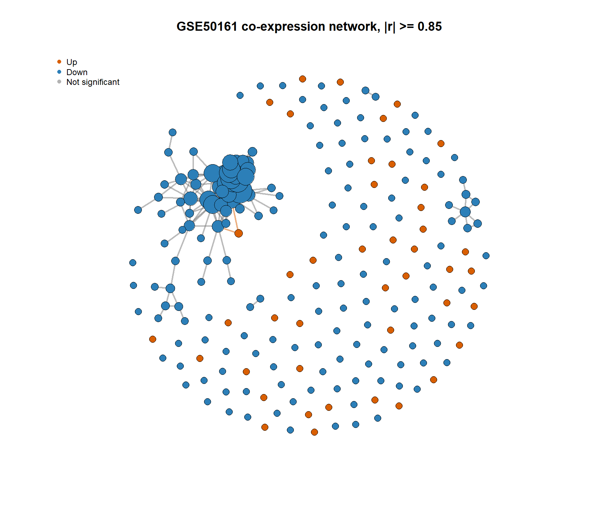

*Figure 26. Co-expression network of selected significant tumor-vs-normal genes. Node color represents regulation direction and node size reflects degree centrality, highlighting coordinated expression modules and candidate hubs.*

Cytoscape-ready files are available in:

- `results/GSE50161/cytoscape/coexpression_nodes.csv`
- `results/GSE50161/cytoscape/coexpression_edges.csv`
- `results/GSE50161/cytoscape/coexpression_network.graphml`
- `results/GSE50161/cytoscape/rScudo_training_network.graphml`

## Discussion

This analysis shows that GSE50161 contains strong transcriptomic signals separating pediatric brain tumor types from normal brain and from each other. The most prominent tumor-vs-normal pattern was a shift away from normal neuronal and synaptic expression toward proliferation, cell-cycle, extracellular matrix, and signaling programs. This is consistent with the basic biology of brain tumors, where bulk tumor tissue contains transformed cells, stromal and immune components, and fewer mature neuronal transcripts than normal brain.

The unsupervised results were informative. With k = 2, clustering primarily separated EPN from all other groups, indicating that EPN has one of the strongest global expression signatures in this dataset. With k = 5, MED was almost perfectly separated, normal samples clustered together, EPN split into two transcriptional subclusters, and GBM and PA remained close. This suggests that some tumor classes are recoverable without labels, while others require supervised models or more focused features.

The supervised models confirmed that class information is strongly encoded in expression data. Random Forest and LASSO both reached 0.938 cross-validated accuracy, Ridge reached 0.931, and LDA reached 0.877. The recurrent GBM/PA confusion is biologically reasonable because both are glioma-related tumor classes and shared parts of the expression space in PCA and k-means. The high performance of regularized regression also suggests that a relatively compact gene signature could classify these samples, although this would need validation in an independent cohort before clinical interpretation.

The rank-based signatures added a complementary perspective. Normal brain signatures were dominated by synaptic and neuronal genes such as `PACSIN1`, `SLC12A5`, `SYNPR`, `VSNL1`, and `GABRG2`. PA signatures included genes linked to glial, extracellular matrix, or developmental biology, including `COL20A1`, `ALDH1A3`, `SOX10`, and `POSTN`. GBM signatures included `FOXG1`, `IL13RA2`, and `TNFAIP6`, which are plausible markers of developmental and inflammatory tumor programs. Because rank-based methods are less dependent on absolute expression scale, these signatures may be useful for cross-platform validation.

The enrichment results were coherent across methods. g:Profiler and GO enrichment emphasized cell junctions, synapses, nervous system development, cell communication, and E2F-associated transcriptional regulation. pathfindR-Reactome highlighted Rho-family GTPase cycles, cell-cycle checkpoints, DNA repair, extracellular matrix organization, and TP53 regulation. These results suggest that tumor-vs-normal differences are not driven by isolated genes but by coordinated biological modules involving proliferation, cytoskeletal organization, cell adhesion, ECM remodeling, and neural differentiation.

Compared with the original GSE50161-associated study, this analysis is broader. Griesinger et al. focused on immune phenotypes and reported tumor-type-specific immune infiltration, with PA and EPN showing high myeloid infiltration relative to normal tissue [2]. The present analysis recovered strong tumor-type-specific expression structure and found immune-relevant pathways such as leukocyte transendothelial migration, cytokine-related genes in rank signatures, HLA genes in PA signatures, and STRING/pathfindR network modules. However, because this analysis used bulk microarray expression rather than flow cytometry or cell deconvolution, immune effects cannot be separated cleanly from tumor-cell, stromal, or tissue-composition effects.

Real-world applications of these results include subtype classification, candidate biomarker discovery, pathway prioritization, and hypothesis generation for immunotherapy. For example, subtype-specific genes from LASSO or Random Forest could be tested as diagnostic markers. Network hubs and pathfindR terms could prioritize pathways for mechanistic experiments. Immune-related enrichment and marker genes could guide follow-up deconvolution analyses to estimate macrophage, microglial, T-cell, or stromal components in each tumor type.

The main limitations are the absence of independent validation, the relatively small normal group, and the use of bulk microarray data. Normal samples came from different brain regions, which may introduce region-specific expression differences. In addition, the tumor samples may vary in cellular composition, necrosis, immune infiltration, and stromal content. Future directions should include validation in RNA-seq cohorts, immune deconvolution, integration with single-cell or spatial datasets, subgroup-aware analysis within each tumor type, and survival or treatment-response association if clinical data become available.

## Conclusion

The GSE50161 dataset contains strong and biologically meaningful expression differences across pediatric brain tumor types and normal brain. Tumor-vs-normal analysis identified thousands of DEGs, with upregulation of proliferation-associated genes and downregulation of neuronal/synaptic markers. PCA and unsupervised clustering recovered major tumor structure, especially EPN and MED separation, while supervised models classified the five groups with high accuracy. Rank-based signatures, enrichment analysis, and network centrality showed that these differences converge on nervous system development, cell junctions, synapses, cell-cycle control, Rho-family GTPase signaling, DNA repair, extracellular matrix organization, and immune-associated processes. Overall, the pipeline provides a reproducible framework for moving from raw public expression data to interpretable biomarkers, pathways, and network hypotheses for pediatric brain tumor biology.

## References

[1] Gene Expression Omnibus. GSE50161: Expression data from human brain tumors and human normal brain. https://www.ncbi.nlm.nih.gov/geo/query/acc.cgi?acc=GSE50161

[2] Griesinger AM, Birks DK, Donson AM, Amani V, Hoffman LM, Waziri A, Wang M, Handler MH, Foreman NK. Characterization of distinct immunophenotypes across pediatric brain tumor types. Journal of Immunology. 2013;191(9):4880-4888. doi:10.4049/jimmunol.1301966.

[3] Davis S, Meltzer PS. GEOquery: a bridge between the Gene Expression Omnibus (GEO) and BioConductor. Bioinformatics. 2007;23(14):1846-1847. doi:10.1093/bioinformatics/btm254.

[4] Ritchie ME, Phipson B, Wu D, Hu Y, Law CW, Shi W, Smyth GK. limma powers differential expression analyses for RNA-sequencing and microarray studies. Nucleic Acids Research. 2015;43(7):e47. doi:10.1093/nar/gkv007.

[5] Liaw A, Wiener M. Classification and regression by randomForest. R News. 2002;2(3):18-22. https://CRAN.R-project.org/doc/Rnews/

[6] Venables WN, Ripley BD. Modern Applied Statistics with S. Fourth Edition. Springer; 2002.

[7] Friedman J, Hastie T, Tibshirani R. Regularization paths for generalized linear models via coordinate descent. Journal of Statistical Software. 2010;33(1):1-22. doi:10.18637/jss.v033.i01.

[8] Kuhn M. Building predictive models in R using the caret package. Journal of Statistical Software. 2008;28(5):1-26. doi:10.18637/jss.v028.i05.

[9] Lauria M. Rank-based transcriptional signatures. Systems Biomedicine. 2013;1(4):228-239. doi:10.4161/sysb.25982.

[10] Ciciani M, Cantore T, Lauria M. rScudo: an R package for classification of molecular profiles using rank-based signatures. Bioinformatics. 2020;36(20):5105-5107. doi:10.1093/bioinformatics/btaa296.

[11] Kolberg L, Raudvere U, Kuzmin I, Vilo J, Peterson H. gprofiler2: an R package for gene list functional enrichment analysis and namespace conversion toolset g:Profiler. F1000Research. 2020;9:709.

[12] Wu T, Hu E, Xu S, Chen M, Guo P, Dai Z, Feng T, Zhou L, Tang W, Zhan L, Fu X, Liu S, Bo X, Yu G. clusterProfiler 4.0: A universal enrichment tool for interpreting omics data. The Innovation. 2021;2(3):100141. doi:10.1016/j.xinn.2021.100141.

[13] Yu G, He QY. ReactomePA: an R/Bioconductor package for Reactome pathway analysis and visualization. Molecular BioSystems. 2016;12(2):477-479. doi:10.1039/C5MB00663E.

[14] Ulgen E, Ozisik O, Sezerman OU. pathfindR: An R package for comprehensive identification of enriched pathways in omics data through active subnetworks. Frontiers in Genetics. 2019;10:858. doi:10.3389/fgene.2019.00858.

[15] Szklarczyk D, Kirsch R, Koutrouli M, Nastou K, Mehryary F, Hachilif R, Gable AL, Fang T, Doncheva NT, Pyysalo S, Bork P, Jensen LJ, von Mering C. The STRING database in 2023: protein-protein association networks and functional enrichment analyses for any sequenced genome of interest. Nucleic Acids Research. 2023;51(D1):D638-D646. doi:10.1093/nar/gkac1000.

[16] Csardi G, Nepusz T. The igraph software package for complex network research. InterJournal, Complex Systems. 2006;1695. https://igraph.org

[17] National Cancer Institute Surveillance, Epidemiology, and End Results Program. Cancer Stat Facts: Childhood Brain and Other Nervous System Cancer, ages 0-19. SEER. https://seer.cancer.gov/statfacts/html/childbrain.html

[18] Ostrom QT, Price M, Neff C, et al. CBTRUS Statistical Report: Pediatric Brain Tumor Foundation Childhood and Adolescent Primary Brain and Other Central Nervous System Tumors Diagnosed in the United States in 2017-2021. Neuro-Oncology. 2025;27(Supplement_1):i1-i64. https://academic.oup.com/neuro-oncology/article/27/Supplement_1/i1/8251654
